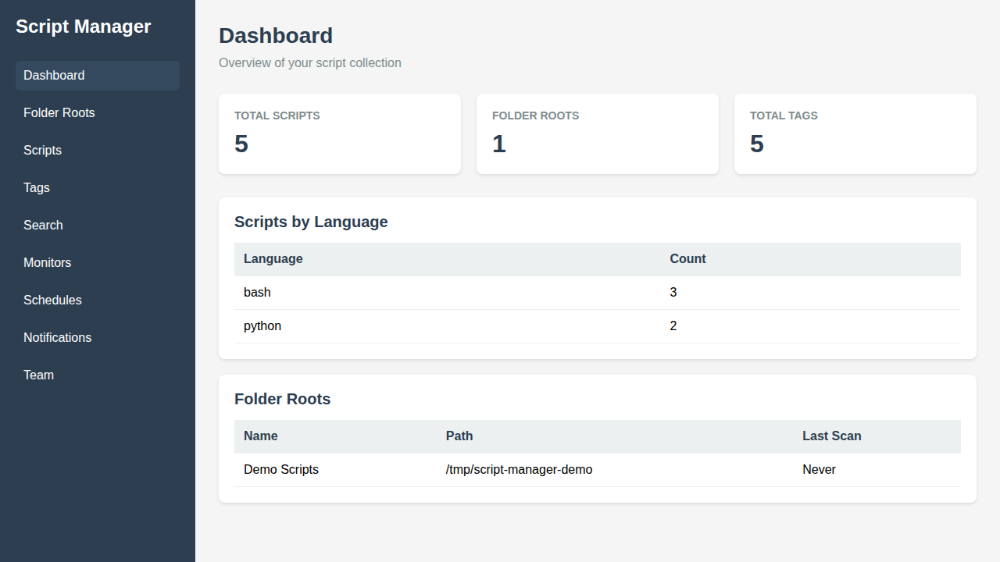
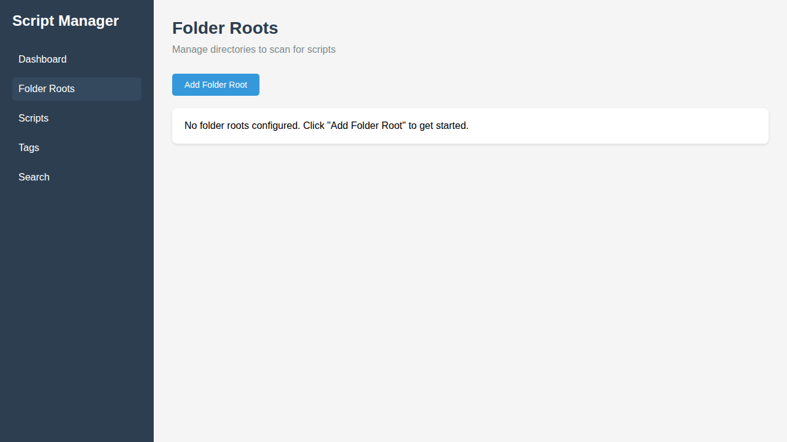
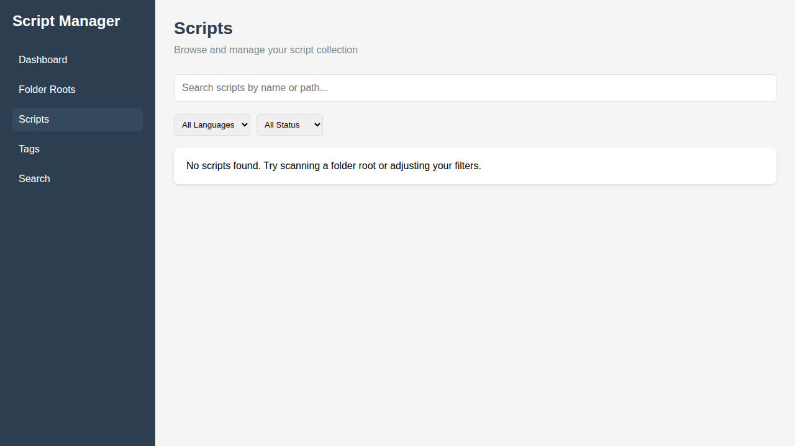
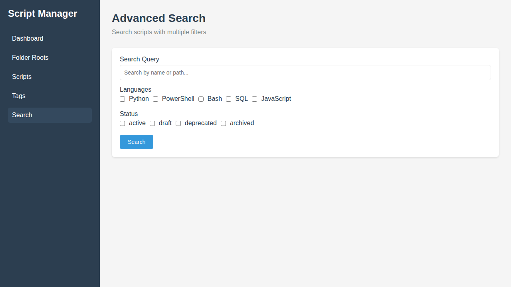

# Script Manager

A web application for managing large collections of script files. Index, search, tag, and organize your Python, PowerShell, Bash, SQL, and other script files across multiple directories.

## Features

- **Script Indexing**: Recursively scan and index scripts from multiple folder roots
- **Metadata Management**: Add notes, tags, status, and classifications to scripts
- **Fast Search**: Search by filename, path, content, tags, and metadata
- **Lifecycle Tracking**: Manage script status (draft, active, deprecated, archived)
- **Duplicate Detection**: Find identical scripts across different locations
- **Bulk Operations**: Apply changes to multiple scripts at once
- **Audit Trail**: Track changes to metadata and script status

## Screenshots

### Dashboard



### Folder Roots



### Scripts



### Tags


### Advanced Search



## Supported Script Types

- Python (.py)
- PowerShell (.ps1, .psm1)
- Bash (.sh)
- Batch (.bat, .cmd)
- SQL (.sql)
- JavaScript (.js)
- YAML (.yml, .yaml)
- JSON (.json)
- Terraform (.tf)

## Quick Start

### Easy Start (Recommended)

**On Linux/Mac:**
```bash
./start.sh
```

**On Windows:**
```bash
start.bat
```

This will automatically:
1. Install dependencies if needed
2. Start both backend and frontend
3. Open the application in your browser

### Manual Start

#### Prerequisites

- Python 3.8 or higher
- Node.js 16 or higher
- npm or yarn

#### Backend Setup

```bash
cd backend
pip install -r requirements.txt
python main.py
```

The API will be available at http://localhost:8000

#### Frontend Setup

```bash
cd frontend
npm install
npm run dev
```

The web interface will be available at http://localhost:3000

## Architecture

- **Backend**: Python with FastAPI
- **Database**: SQLite with indexes for fast queries
- **Frontend**: React with modern UI components
- **API**: RESTful API with JSON responses

## Configuration

Configuration options can be set via environment variables:

- `DATABASE_PATH`: Path to SQLite database (default: `./data/scripts.db`)
- `API_PORT`: Backend API port (default: `8000`)

## Documentation

- [API Documentation](./docs/API.md)
- [User Guide](./docs/USER_GUIDE.md)
- [Development Guide](./docs/DEVELOPMENT.md)

## License

MIT License - see LICENSE file for details
