# Script Manager

[](https://github.com/jomardyan/Script-Manager/actions/workflows/build-test.yml)
[](https://opensource.org/licenses/MIT)
[](https://github.com/jomardyan/Script-Manager)
[](https://github.com/jomardyan/Script-Manager/fork)
[](https://www.python.org/downloads/)
[](https://reactjs.org/)
[](https://fastapi.tiangolo.com/)
[](https://www.docker.com/)

A web application for managing large collections of script files. Index, search, tag, and organize your Python, PowerShell, Bash, SQL, and other script files across multiple directories.

## Features

- **First-Time Installation Wizard**: Guided onboarding for new administrators with three modes
- **Script Indexing**: Recursively scan and index scripts from multiple folder roots
- **Metadata Management**: Add notes, tags, status, and classifications to scripts
- **Fast Search**: Search by filename, path, content, tags, and metadata
- **Full-Text Search (FTS)**: Porter-stemmed full-text search across script content and notes
- **Lifecycle Tracking**: Manage script status (draft, active, deprecated, archived)
- **Duplicate Detection**: Find identical scripts across different locations
- **Similarity Detection**: Discover similar scripts using content-based analysis
- **Bulk Operations**: Apply changes to multiple scripts at once
- **Audit Trail**: Track changes to metadata and script status
- **Attachments**: Upload and attach files to scripts or notes
- **Saved Searches**: Pin and reuse frequently used search queries
- **Watch Mode**: Automatically detect filesystem changes in real time
- **Heartbeat Monitors**: Track external cron jobs and services with fail-safe alerts
- **Schedule Jobs**: Run and manage cron-scheduled commands with execution history
- **Notifications**: Send alerts via Slack, Discord, email, webhook, PagerDuty, or SMS
- **Incident Management**: Automatically group and track failures as incidents
- **Authentication & RBAC**: JWT-based auth with role-based access control (admin, viewer, editor)

## Installation Wizard

When you open Script Manager for the first time, you are greeted by the **Installation Wizard** — a guided onboarding experience that gets you up and running in seconds.

### Wizard Modes

| Mode | Description |
|------|-------------|
| 🎮 **Demo** | One-click start with pre-loaded sample scripts, tags, and a demo folder root. No configuration needed — perfect for evaluation. |
| 🚀 **Production** | Full setup flow: choose your database, configure the connection, and create a secure administrator account. |
| 🛠️ **Development** | Streamlined setup for contributors and developers. Uses SQLite with sensible defaults, skipping unnecessary steps. |

### Wizard Steps (Production / Development)

1. **Welcome** — Select your desired mode
2. **Database Configuration** — Choose and configure your database backend:
   - **SQLite** (default, recommended for single-server deployments)
   - **MySQL / MariaDB** — provide host, port, database name, and credentials
   - **PostgreSQL** — provide host, port, database name, and credentials
   - Use the built-in **Test Connection** button to validate before proceeding
3. **Admin Account** — Create the first administrator account (username, email, password)
4. **Done** — Confirmation screen with an "Enter Script Manager" button

> **Note:** MySQL and PostgreSQL support requires installing the corresponding driver package
> (`aiomysql` for MySQL, `asyncpg` for PostgreSQL) and restarting the backend after setup.
> SQLite works out-of-the-box with no additional dependencies.

### Setup API

The wizard is powered by a dedicated REST API:

| Endpoint | Method | Description |
|----------|--------|-------------|
| `/api/setup/status` | GET | Returns `{ setup_completed, mode }` — used by the frontend on every load |
| `/api/setup/demo` | POST | Activates demo mode and seeds sample data |
| `/api/setup/complete` | POST | Completes setup with database + admin configuration |
| `/api/setup/test-db` | POST | Tests a database connection without persisting anything |

### Screenshots

#### Welcome Screen — Mode Selection

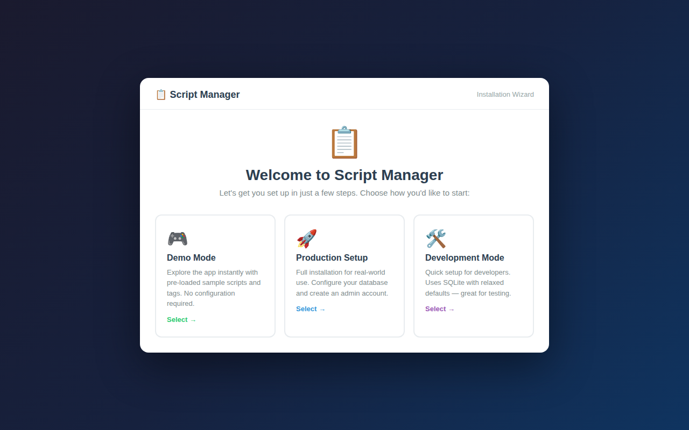

#### Database Configuration

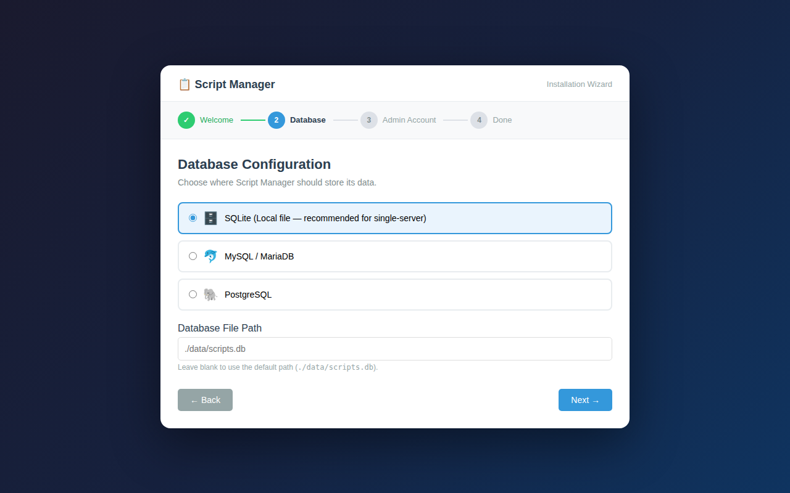

#### Admin Account Creation

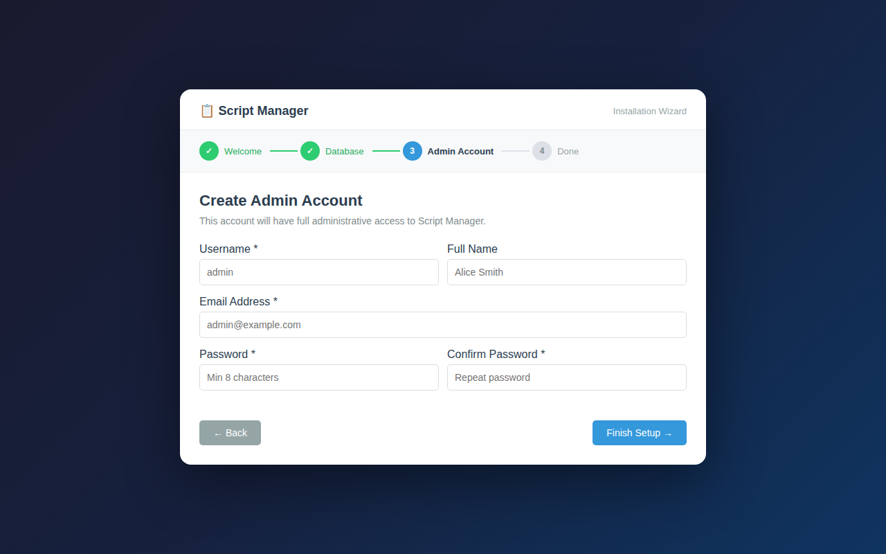

#### Setup Complete

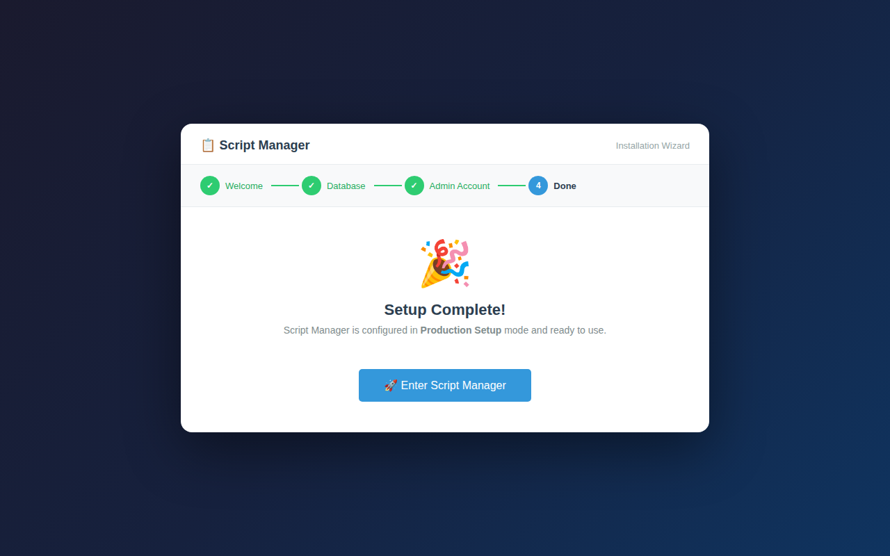

## Screenshots

### Dashboard

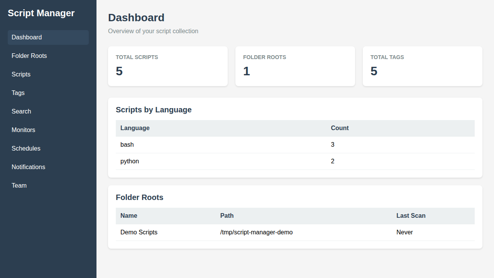

### Folder Roots

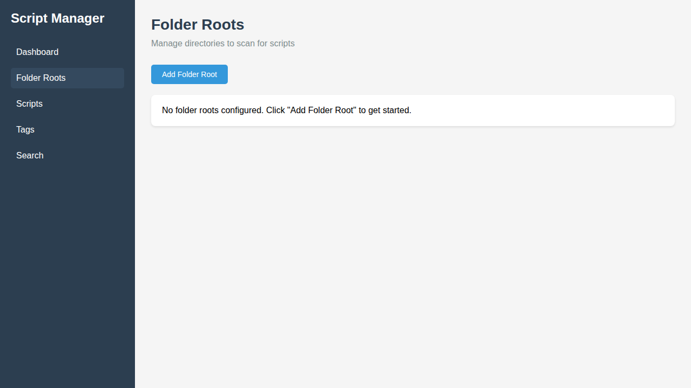

### Scripts

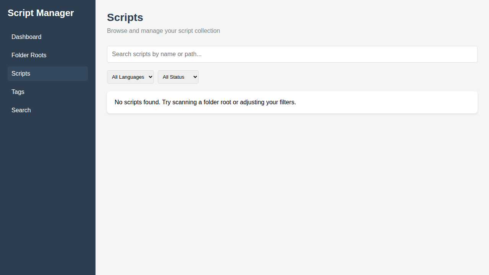

### Tags

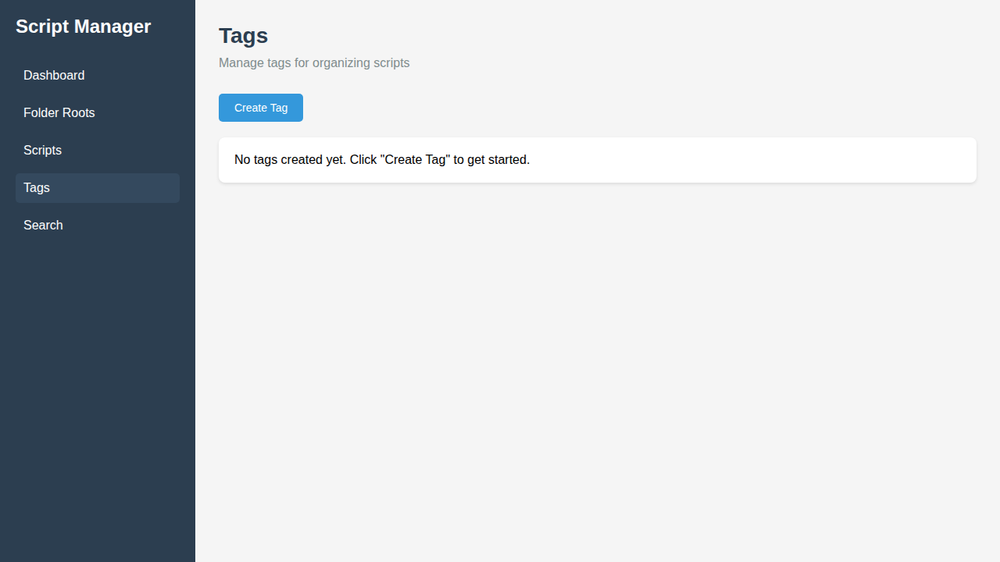

### Advanced Search

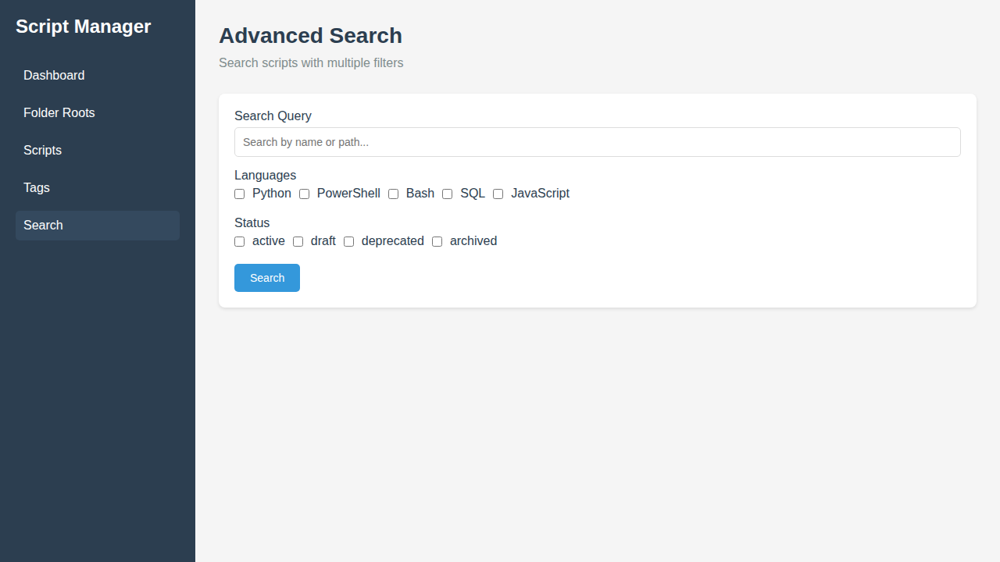

### Monitors

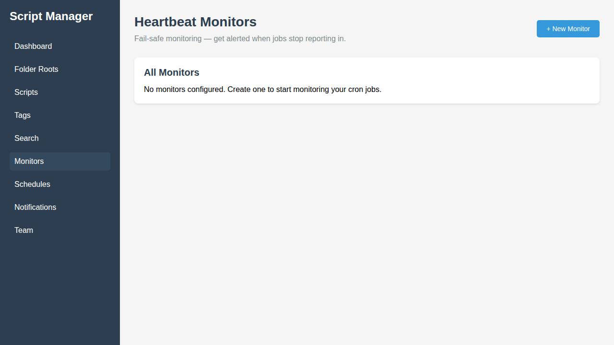

### Schedules

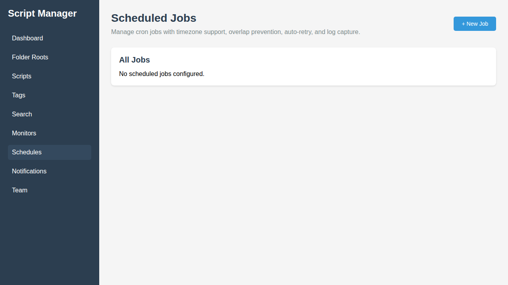

### Notifications

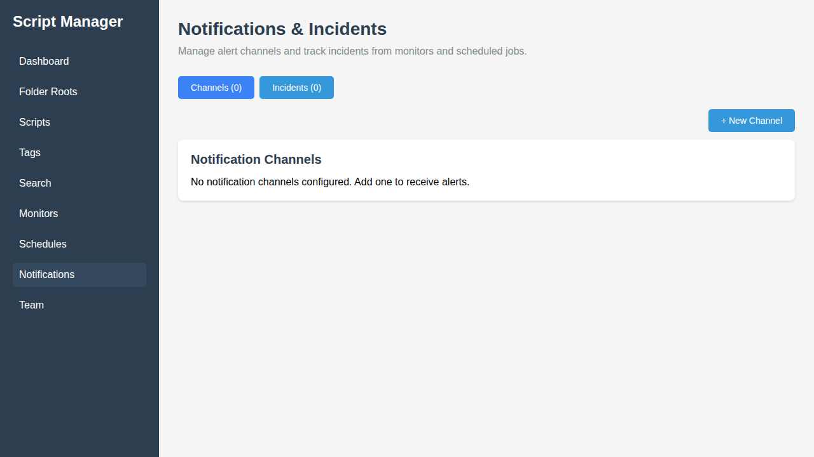

## Supported Script Types

- Python (.py)
- PowerShell (.ps1, .psm1)
- Bash (.sh)
- Batch (.bat, .cmd)
- SQL (.sql)
- JavaScript (.js)
- YAML (.yml, .yaml)
- JSON (.json)
- Terraform (.tf)

## Heartbeat Monitors

Heartbeat Monitors track external cron jobs, backup scripts, or any scheduled process by waiting for periodic **ping** calls. If a ping doesn't arrive within the expected interval plus the grace period, the monitor transitions to **failing** and an Incident is created automatically.

### How it works

1. Create a monitor and note the generated `ping_key`
2. Add a curl call to the end of your cron job: `curl -s https://your-host/api/monitors/ping/<ping_key>`
3. Script Manager tracks pings and raises an incident if one is missed

### Monitor API

| Endpoint | Method | Description |
|----------|--------|-------------|
| `/api/monitors/` | GET | List all monitors |
| `/api/monitors/` | POST | Create a monitor |
| `/api/monitors/{id}` | GET / PUT / DELETE | Read, update, or delete a monitor |
| `/api/monitors/{id}/pause` | POST | Pause alerting for a monitor |
| `/api/monitors/{id}/resume` | POST | Resume alerting for a monitor |
| `/api/monitors/ping/{ping_key}` | POST | Record a heartbeat ping |
| `/api/monitors/{id}/pings` | GET | List recent ping history |
| `/api/monitors/{id}/incidents` | GET | List incidents for a monitor |

## Schedule Jobs

Schedule Jobs let you define cron-scheduled tasks that run shell commands or indexed scripts. Execution history is captured (stdout, stderr, exit code, duration) and performance metrics are available for trend analysis.

### Features

- Cron expression scheduling with timezone support
- Overlap prevention (a job won't start a second instance while still running)
- Auto-retry on failure (configurable retries and delay)
- Timeout enforcement
- Full stdout/stderr capture per execution
- Notification channel integration (alert on failure or success)

### Schedule API

| Endpoint | Method | Description |
|----------|--------|-------------|
| `/api/schedules/` | GET | List all scheduled jobs |
| `/api/schedules/` | POST | Create a scheduled job |
| `/api/schedules/{id}` | GET / PUT / DELETE | Read, update, or delete a job |
| `/api/schedules/{id}/enable` | POST | Enable a disabled job |
| `/api/schedules/{id}/disable` | POST | Disable a job |
| `/api/schedules/{id}/trigger` | POST | Manually trigger a job immediately |
| `/api/schedules/{id}/executions` | GET | List execution history |
| `/api/schedules/{id}/metrics` | GET | Performance metrics for a job |

## Notifications

Notification Channels deliver alerts when monitors fail, schedule jobs error, or incidents are created.

### Supported Channel Types

| Type | Description |
|------|-------------|
| `slack` | Post messages to a Slack channel via Incoming Webhooks or Bot tokens |
| `discord` | Send messages to a Discord channel via webhooks |
| `email` | Send SMTP email notifications |
| `webhook` | HTTP POST to any generic webhook URL |
| `pagerduty` | Create PagerDuty incidents via Events API v2 |
| `sms` | SMS via Twilio (account_sid + auth_token) |

### Notifications API

| Endpoint | Method | Description |
|----------|--------|-------------|
| `/api/notifications/channels/` | GET / POST | List or create channels |
| `/api/notifications/channels/{id}` | GET / PUT / DELETE | Read, update, or delete a channel |
| `/api/notifications/channels/{id}/test` | POST | Send a test notification (auth required) |
| `/api/notifications/incidents/` | GET | List all incidents |
| `/api/notifications/incidents/{id}` | GET / PUT / DELETE | Read, update, or delete an incident |

> **Security note:** Secret config keys (`token`, `webhook_url`, `auth_token`, etc.) are always redacted (`***`) in API responses.

## Authentication & RBAC

Script Manager uses **JWT Bearer tokens** for authentication and **role-based access control** for authorization.

### Default Roles

| Role | Permissions |
|------|-------------|
| `admin` | Full access — manage users, roles, and all resources |
| `editor` | Create, update, and delete scripts, tags, notes, and searches |
| `viewer` | Read-only access to scripts and tags |

### Auth API

| Endpoint | Method | Description |
|----------|--------|-------------|
| `/api/auth/login` | POST | Log in and receive an access token (form data) |
| `/api/auth/me` | GET | Get the current authenticated user |
| `/api/auth/register` | POST | Register a new user (admin only) |
| `/api/auth/change-password` | PUT | Change password for the current user |
| `/api/auth/users` | GET | List all users (admin only) |
| `/api/auth/roles` | GET | List all roles |

## Quick Start

### Using Makefile (Recommended for Development)

The project includes a comprehensive Makefile for common tasks:

```bash
# View all available commands
make help

# Install all dependencies
make install

# Run tests
make test

# Build for production
make build

# Start with Docker
make docker-up
```

See [Makefile Documentation](./docs/MAKEFILE.md) for complete command reference.

### Docker Setup (Recommended for Production)

#### Prerequisites
- Docker and Docker Compose installed

#### Quick Start with Docker

```bash
# Clone the repository
git clone https://github.com/jomardyan/Script-Manager
cd Script-Manager

# Start the application
./docker.sh up
# or on Windows
docker.bat up
```

The application will be available at:
- **Frontend**: http://localhost:3000
- **Backend API**: http://localhost:8000
- **API Docs**: http://localhost:8000/docs

On first launch you will be redirected to the **Installation Wizard** automatically.

#### Stop the Application

```bash
./docker.sh down
# or on Windows
docker.bat down
```

#### Helper Commands

Use the convenient helper scripts for common tasks:

```bash
# View logs
./docker.sh logs -f

# Check health
./docker.sh health

# Access backend shell
./docker.sh shell-backend

# Production setup with Nginx
./docker.sh prod

# See all commands
./docker.sh help
```

**Windows users**: Replace `./docker.sh` with `docker.bat`

See [Docker Quick Reference](./docs/DOCKER_QUICK_REFERENCE.md) for more commands.

### Docker Configuration

**Mounting Script Directories**

To scan scripts from your host machine, edit `docker-compose.yml` and modify the `backend` service volumes:

```yaml
volumes:
  - script_data:/app/data
  - /path/to/your/scripts:/scripts:ro
```

Then in the UI, create a folder root with path `/scripts`.

**Environment Variables**

Copy `.env.example` to `.env` and customize:

```bash
cp .env.example .env
```

Available variables:
- `API_PORT`: Backend API port (default: 8000)
- `DATABASE_PATH`: SQLite database location (default: /app/data/scripts.db)
- `VITE_API_URL`: Frontend API URL (default: http://localhost:8000)

**Production Deployment with Nginx**

For a production-like setup with Nginx reverse proxy:

```bash
./docker.sh prod
# or on Windows
docker.bat prod
```

Then access the application at `http://localhost` (port 80).

See [Docker Deployment Guide](./docs/DOCKER.md) for detailed configuration and troubleshooting.

### Traditional Setup

#### Easy Start (Recommended)

**On Linux/Mac:**
```bash
./start.sh
```

**On Windows:**
```bash
start.bat
```

This will automatically:
1. Install dependencies if needed
2. Start both backend and frontend
3. Open the application in your browser
4. Redirect you to the Installation Wizard on first run

#### Manual Start

##### Prerequisites

- Python 3.8 or higher
- Node.js 16 or higher
- npm or yarn

##### Backend Setup

```bash
cd backend
pip install -r requirements.txt
python main.py
```

The API will be available at http://localhost:8000

##### Frontend Setup

```bash
cd frontend
npm install
npm run dev
```

The web interface will be available at http://localhost:3000

## Architecture

- **Backend**: Python with FastAPI
- **Database**: SQLite (default) — MySQL and PostgreSQL configurable via setup wizard
- **Frontend**: React with modern UI components
- **API**: RESTful API with JSON responses
- **Containerization**: Docker and Docker Compose for easy deployment

## Docker Architecture

When running with Docker Compose, the following services are orchestrated:

```
┌─────────────────────────────────────────────┐
│         Docker Compose Network              │
│                                             │
│  ┌──────────────┐      ┌──────────────┐     │
│  │  Frontend    │      │  Backend     │     │
│  │  React       │◄────►│  FastAPI     │     │
│  │  Port 3000   │      │  Port 8000   │     │
│  └──────────────┘      └──────────────┘     │
│         ▲                      ▲            │
│         │                      │            │
│         └──────┬───────────────┘            │
│                │                            │
│         ┌──────▼────────┐                   │
│         │  Volume       │                   │
│         │  script_data  │                   │
│         │  (Database)   │                   │
│         └───────────────┘                   │
│                                             │
└─────────────────────────────────────────────┘
```

### Services

- **backend**: FastAPI application with Python
- **frontend**: React application (built with Vite)
- **script_data volume**: Persistent storage for SQLite database
- **Optional nginx**: Reverse proxy for production deployments

## Configuration

Configuration options can be set via environment variables:

- `DATABASE_PATH`: Path to SQLite database (default: `./data/scripts.db`)
- `API_PORT`: Backend API port (default: `8000`)

## API Reference

The full interactive API documentation is available at **http://localhost:8000/docs** when the backend is running.

### Core Endpoints

| Prefix | Description |
|--------|-------------|
| `/api/setup` | Installation wizard |
| `/api/auth` | Authentication and user management |
| `/api/folder-roots` | Manage script folder roots |
| `/api/scripts` | Script CRUD and metadata |
| `/api/tags` | Tag management |
| `/api/notes` | Script notes (markdown supported) |
| `/api/search` | Advanced script search |
| `/api/fts` | Full-text search |
| `/api/saved-searches` | Save and pin search queries |
| `/api/attachments` | Upload and retrieve file attachments |
| `/api/similarity` | Find similar scripts |
| `/api/watch` | Real-time filesystem watch mode |
| `/api/monitors` | Heartbeat monitor management |
| `/api/schedules` | Scheduled job management |
| `/api/notifications` | Notification channels and incidents |

## Documentation

- [Makefile Commands](./docs/MAKEFILE.md) - **Complete command reference for development**
- [Production Deployment Guide](./docs/PRODUCTION.md) - **Production-ready deployment best practices**
- [Docker Deployment Guide](./docs/DOCKER.md) - Complete Docker setup and troubleshooting
- [Docker Quick Reference](./docs/DOCKER_QUICK_REFERENCE.md) - Quick command reference
- [API Documentation](./docs/API.md)
- [User Guide](./docs/USER_GUIDE.md)
- [Development Guide](./docs/DEVELOPMENT.md)

## License

MIT License - see LICENSE file for details


